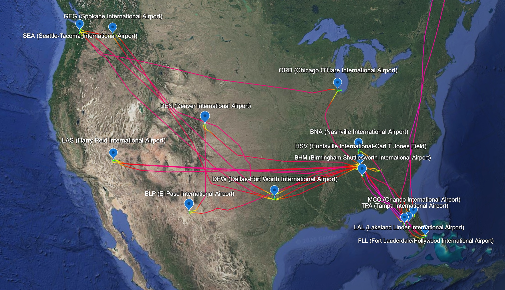
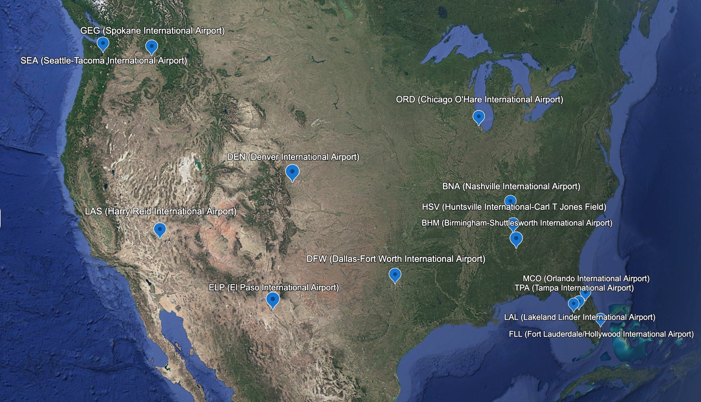

# ✈️ Flight KML Tools for Google Earth

A collection of lightweight browser & Python utilities for flight enthusiasts, frequent flyers, and pilots to clean flight tracks and generate custom airport pushpin maps for **Google Earth**.

> 🚀 **Live Web App:** [https://jleshnick.github.io/flight-kml-cleaner-and-airport-pins/](https://jleshnick.github.io/flight-kml-cleaner-and-airport-pins/)

---

## 🌐 Web App (GitHub Pages) — Recommended

Run both tools directly in your browser without installing Python or terminal commands!

👉 **[Launch Flight KML Tools Web App](https://jleshnick.github.io/flight-kml-cleaner-and-airport-pins/)**

- ⚡ **100% Client-Side & Private**: Your flight files are processed instantly in your browser and are **never** uploaded to any server.
- ✈️ **KML Track Cleaner**: Drag and drop Flightradar24 or FlightAware `.kml` files to strip point clutter, shrink file size by up to 95%, and automatically append the **date & departure time (UTC)** to the folder name in Google Earth (e.g., `AA1667 (2026-08-11 14:30 UTC)`) and output filename (e.g., `AA1667_2026-08-11_1430_UTC.kml`).
- 📍 **Airport Pin Generator**: 
  - **Enter Airport Codes**: Type any 3 or 4-letter IATA/ICAO airport codes (e.g., `BNA, DFW, LHR, FCO`) to instantly preview matched airport names, cities, and countries.
  - **Auto-Extract from Flight KMLs**: Drop one or multiple flight KML logs to automatically extract origin and destination airport codes.
- 📱 **Cross-Platform**: Works on Mac, PC, Chromebooks, iPads, and mobile browsers.

---

### 📸 Google Earth Previews


*Example: Clean 3D flight paths paired with styled FlightAware airport pushpins imported into Google Earth.*


*Example: Visited airport pushpins showing airport codes, full names, locations, and live FlightAware activity links.*

---

### 🚀 How to Enable GitHub Pages

1. Go to repository **Settings** ➔ **Pages** at [`https://github.com/JLeshnick/flight-kml-cleaner-and-airport-pins/settings/pages`](https://github.com/JLeshnick/flight-kml-cleaner-and-airport-pins/settings/pages).
2. Under **Build and deployment** ➔ **Source**, select **Deploy from a branch**.
3. Choose the **`main`** branch and root **`/ (root)`** folder, then click **Save**.
4. GitHub Pages will build and host your app live at: [https://jleshnick.github.io/flight-kml-cleaner-and-airport-pins/](https://jleshnick.github.io/flight-kml-cleaner-and-airport-pins/)!

---

## 📖 Step-by-Step Tutorial: How to Get & Import Flight KML Files

### 1. Exporting Flight KML Tracks

#### Exporting from Flightradar24:
1. Log in to **Flightradar24**.
2. Go to **My Flightradar24** or search for any historical flight.
3. Click on **Download / Export Data**.
4. Choose **KML** (or **KML Track**) and save the file.

#### Exporting from FlightAware:
1. Go to [flightaware.com](https://flightaware.com) and search for your flight.
2. Under the flight track map, click **Google Earth (KML)**.
3. Download the `.kml` track file.

---

### 2. Importing Cleaned KMLs into Google Earth

#### Google Earth Web (Browser):
1. Open [earth.google.com](https://earth.google.com/web/).
2. Click **Projects** ➔ **New Project** ➔ **Import KML file from computer**.
3. Select your cleaned flight `.kml` tracks or generated `Airport_Pins.kml`.

#### Google Earth Pro (Desktop App):
1. Launch **Google Earth Pro**.
2. Select **File** ➔ **Open...** and pick your `.kml` files.
3. Drag items into **My Places** to save your flight map permanently.

---

## 🐍 Command Line & Python Scripts (For Power Users)

For users who prefer batch processing entire directories via terminal, automated scripts, or cron jobs:

### 1. `clean_fr24_kml.py` — Flight Track Optimizer

Strips out thousands of high-density `Route` Placemark points while preserving 3D continuous flight lines, metadata, and styling. Automatically tags folder names with date and time (e.g. `AA1667 (2026-08-11 14:30 UTC)`).

```bash
# Clean a single file (overwrites in-place):
python3 clean_fr24_kml.py flight.kml

# Batch clean all KML files in Downloads folder:
python3 clean_fr24_kml.py ~/Downloads/*.kml

# Save to a new file instead of overwriting:
python3 clean_fr24_kml.py flight.kml --no-inplace
```

### 2. `generate_airport_pins.py` — Styled Airport Pin Generator

Generates Google Earth pushpin KML placemarks with FlightAware formatting, resolving ~29,000 global airports automatically.

```bash
# Quick interactive prompt:
python3 generate_airport_pins.py

# Generate pins for specific airport codes:
python3 generate_airport_pins.py BNA DFW LHR FCO -o Visited_Airports.kml

# Read airport codes from a text/CSV file:
python3 generate_airport_pins.py -f my_airports.txt -o Visited_Airports.kml

# Scan a folder of flight KML files to detect all visited airports automatically:
python3 generate_airport_pins.py --scan ~/Downloads/*.kml -o Scanned_Airports.kml
```

---

## 📁 Repository Structure

```text
flight-kml-tools/
│
├── index.html                 # Single-page GitHub Pages Web App
├── airports_db.js             # Offline minified dataset (~29,000 global airports)
├── clean_fr24_kml.py          # Python KML flight path optimizer CLI
├── generate_airport_pins.py   # Python airport pin generator CLI
├── README.md                  # Comprehensive documentation and tutorial
└── images/
    ├── google_earth_map_overview.jpeg   # Preview 1: 3D Flight paths & Airport pushpins
    └── airport_pins_sample.jpeg        # Preview 2: Visited Airport pushpins with FlightAware links
```

---

## 👤 Author & Credits

Created by **[Joshua Leshnick](https://github.com/JLeshnick)**

---

## 🤝 License

MIT License — free for personal and commercial use.
